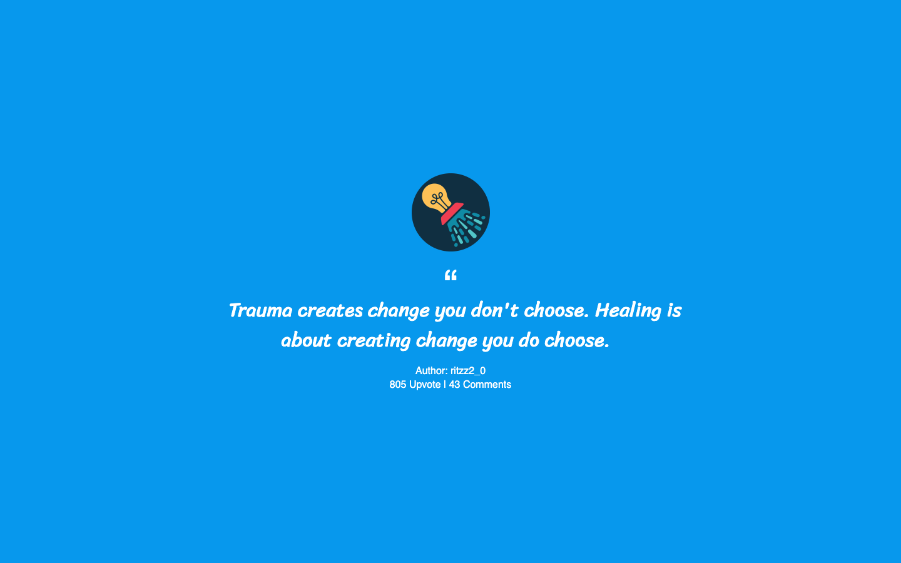

# vue-showerthoughts

Simple Vue.js app that pulls showerthoughts from the Reddit API

<div align="center">
   
</div

[showerthoughts-asyrafhussin.netlify.com](https://showerthoughts-asyrafhussin.netlify.com)

[](https://app.netlify.com/sites/showerthoughts-asyrafhussin/deploys)

## Project setup

```
npm install
```

### Compiles and hot-reloads for development

```
npm run serve
```

### Compiles and minifies for production

```
npm run build
```

### Lints and fixes files

```
npm run lint
```

### Customize configuration

See [Configuration Reference](https://cli.vuejs.org/config/).
